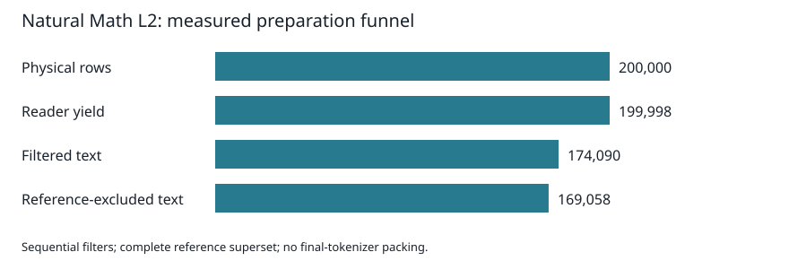

# Allocating data and exact memory for a compute-bounded small language model

**Working manuscript, pre-results.** This draft defines the methods and reporting structure for
Speck's flagship program. The central model-quality, transfer, and hardware claims remain dependent
on the experiments registered in [`claims.json`](../claims.json). The title is descriptive; no
best-at-size or non-inferiority headline is supported yet.

## Abstract

We study the allocation of limited training compute between data quality and sequence memory in a
small language model. Our planned controlled program compares source treatments, data reuse, and
periodically placed exact-attention layers in a Kimi Delta Attention (KDA) backbone. We preregister
transfer and composition tests before training a fixed 1.2B-parameter flagship held out from model
selection. The resource envelope is 5,000 GH200 GPU-hours on one four-GPU node over approximately
three months. This draft reports completed data-preparation evidence and specifies the planned model
experiments. Final model-quality, useful-context, and realized hardware results will determine the
paper's conclusions.

## 1. Resource-allocation problem

The working target is a 1.2B KDA/GQA model trained on 400B tokens, with a 320B-token throughput
fallback. Five thousand GPU-hours equal approximately 52.1 days at continuous four-GPU occupancy;
calendar availability is not equivalent to continuous node use. Actual arm64 dependencies, kernels,
distributed training, storage, scheduling, and exact-shape throughput require qualification on the
allocated node. The flagship is not used to choose the preceding experimental configuration.

We distinguish analytic training FLOPs from elapsed GPU cost, and separate recurrent state,
length-growing attention state, weights, workspace, and peak allocation. Context allocation alone
does not establish trained, effective, or usable context length.

## 2. Controlled framework

### 2.1 Evidence and execution identity

Source releases are pinned by dataset revision and complete-file hashes. Preparation retains physical
row and content identities together with available source metadata. Each scientific execution binds
its implementation, configuration, tokenizer, data order, model, evaluation inputs, and checkpoint
lineage. Failed or interrupted work remains part of cost accounting. A recovered measurement is
distinguished from a missing measurement; unavailable GPU peak allocation is not imputed as zero.

Source use follows the recorded owner decisions and release scope. Raw text and derived packed
shards are retained internally; public artifacts include weights, code, methods, metadata, aggregate
statistics, citations, and required notices. Natural UltraData-Math L2-preview has an additive source
approval. Its lack of original URLs and parent identifiers limits provenance and URL-based removal
coverage; dataset revision, shard/row, and content hashes are retained instead.

### 2.2 Data separation and exclusion

Tokenizer training, model training, selection-heldout views, and sealed audits have distinct roles.
Preparation gives the complete declared reference superset precedence over new candidates, followed
by candidate deduplication. Exact exclusion uses normalized-content identities. Near exclusion uses
the frozen MinHash candidate-generation and verified token-shingle Jaccard policy. Zero measured
exact overlap does not establish absence of every semantic, ancestry, or approximate duplicate.

The Math L2 preparation reuses a private verified checkpoint containing 288,872 reference records.
All six category slots are explicitly rebound, with only the new math slot populated. Exact and
near positive controls and unchanged reference outputs test this execution path.

### 2.3 Tokenizer comparison

The frozen tokenizer screen compares Mistral 32K with two statically nominated custom BPE endpoints
under one backbone and whole-document stream. It measures both fixed-document and fixed-analytic-FLOP
endpoints. The custom screen winner is nominated by fixed-document equal-category macro BPB with
predeclared tie rules. Full confirmation must fit the 30-local-GPU-hour ceiling after all-attempt
accounting; exceeding that budget retains the declared Mistral fallback without opening D5.
The completed three-arm screen nominates custom 32K among the custom endpoints. Fixed-document
macro BPB is 1.095404 for Mistral, 1.103594 for custom 32K, and 1.109141 for custom 40,960;
fixed-FLOP macro BPB is respectively 1.095404, 1.066491, and 1.107122. The active-duration lower
bound on completed screens plus required confirmations is 32.8763 GPU-hours, above the 30-hour ceiling.
The [checked decision](../../research/flagship/tokenizer_decision_v1.json) therefore freezes the
declared Mistral fallback without opening D5. Historical all-attempt expenditure remains incomplete;
missing costs cannot reverse this budget stop. The fallback does not establish replicated custom
inferiority.

### 2.4 Evaluation and statistical reporting

The six formal categories are web, code, math, synthetic, science, and reference. The selected
heldout contract requires production-formatted and independently extracted views, paired by immutable
document identity. Per-document BPB is NLL in nats divided by natural-log two and exact view UTF-8
bytes. Category scores are mean document BPB; the primary score gives each category equal weight.
Category guardrails must pass independently in both parser views. Sealed audits are not selection
search data.

The current heldout tooling has fixture qualification; a real two-view bundle and pre-results
execution/analysis manifests are still required. Finalist nomination, replicated comparisons, ties,
failed runs, and fallback handling must be fixed within the budget before model outputs. Tables will
retain all arms and seeds, with uncertainty at the declared document and training-seed units.

## 3. Allocating training data

The proposed category prior is 55/15/10/10/5/5 percent. Source screens replace only the tested category
inside a complete mixture. E1W allocates eight 350M/8B-token logical slots; E1S allocates fifteen
150M/2B-token slots across code, math, and synthetic sources. E3 compares one, two, and four effective
epochs at a matched 6B-token exposure, over seeds 42 and 43. These 29 slots retain a combined
192-GPU-hour ceiling. Exact source recipes, training settings, language allocations, and eligibility
views remain subject to their pre-results freeze and GH200 qualification.

### 3.1 Completed preparation evidence

The first two pinned natural Math L2-preview shards provide 200,000 physical rows. Sequential reader,
benchmark, security, repetition, and math-prose English checks retain 174,090 records. Full reference
exclusion and candidate deduplication retain 169,058 documents containing 384,788,210 Mistral-reference
tokens, including BOS/EOS. This exceeds the nominal 200M-token math-challenger component requirement.
The counting tokenizer is byte-identical to the selected Mistral base tokenizer, so these counts carry
forward without retokenization. Packing and per-arm membership remain open.

The complete first English FineWiki shard additionally retains 387,313 documents containing
582,070,378 selected-tokenizer tokens, covering the proposed 400M-token reference background.
Acquisition finished before interruption; the resumed exclusion passed artifact, reference-preservation,
and positive-control checks. Its 283.77-second exclusion timing and 508.01 MiB observed WAL peak cover
only the resumed invocation. Complete original-invocation timing and peak are unavailable.

Figure S1. Preparation attrition for two complete pinned Math L2-preview shards. This source-specific
funnel is not a six-category quality result. Machine-generated counts and costs appear in
[`math-preparation-funnel.md`](../tables/math-preparation-funnel.md) and
[`preparation-cost.md`](../tables/preparation-cost.md).

The combined two-shard peS2o stock retains 113,232 documents and 820,097,493 tokens after the declared
paper-license, English, OCR, security, and full reference-exclusion processing. This clears its 480M
preparation-headroom target. The earlier 403.56M-token stock is a verified included prefix, so the
combined count replaces it. These source-specific stocks still require joint experiment-view checks.

The original eight-shard FineMath stock retained 545,996 documents and 814,103,172 selected-tokenizer
tokens, short of the 960M preparation target. Its outage recovery and physical-index migration
remain preserved, including incomplete original timing/WAL observations. An eleven-shard successor
under unchanged filters now retains **753,071 documents and 1,124,167,472 tokens**, exceeding the
800M nominal requirement and the 960M headroom target (by 164,167,472 tokens). The original retained
text is a verified exact prefix; the successor replaces that measurement. Full exclusion controls
and output/index/removal checks pass, and its document-indexed token cache reproduces the count.
Natural postfilter domain proportions are retained (56,661 known hosts; byte HHI 0.006351). These
are preparation diagnostics and reusable inputs, not model-quality or joint-view results.

The successor exclusion invocation took 29,160.84 seconds during concurrent local preparation;
15,665.03 seconds (53.72%) were attributed to SQLite commit and are already included in that total.
Its observed WAL peak was 514.85 MiB, above the earlier 512 MiB observation but within the declared
2 GiB gate. Cache construction measured 195.76 seconds, with surrounding verification additional.
The [completion finding](../../research/findings/2026-09-15-finemath-headroom.md) preserves these
boundaries; they do not establish a controlled speedup or GH200 throughput.

The five-shard Cosmopedia stock retains **1,851,034 documents and 1,489,288,743 tokens**,
exceeding its 960M headroom target by 529,288,743 tokens. Its document cache reproduces these
counts; completion review checks raw/acquisition/publication identities, reference preservation,
exclusion controls and cache reopen. Repeated full-prompt hashes occur in 33,190 documents beyond
their first occurrence; prompt hashes do not establish original seed ancestry. The exclusion
invocation measured 59,059.41 seconds, including 48,855.77 seconds (82.72%) in SQLite commit,
during concurrent local preparation. Cache construction measured 264.42 seconds. The
[completion finding](../../research/findings/2026-09-15-cosmopedia-stock.md) preserves lineage
limitations and timing boundaries; these are preparation results, not correctness or learning gains.

The [source-capacity table](../tables/source-capacity-v5/source-capacity.md) compares preparation requirements
only with source-identical measured stock. It does not replace Stack-Edu with Common Pile's
Stack-v2-derived view or peS2o with PubMed merely because they share a category. Independent banks are
not summed as a unique union. Missing measurements remain explicit.

The code comparison has a [pre-results language allocation](../../research/flagship/CODE_LANGUAGES.md)
covering eleven shared languages. The same selected-tokenizer proportions apply independently to
each source and to both halves of the equal blend; preparation headroom is required per language.
The allocation is a declared preparation prior, not an empirically optimal mix. Finalist identities
remain unselected, and matched language shares do not erase source-specific license/vendor differences.

### 3.2 Model results to be reported

Report every source arm, finalist replication, equal-category effect, and per-category guardrail in
both parser views. Follow with the registered E2 mixture, E3 repetition, and E4 decay comparisons.
Do not infer learning-quality gains from compression, source labels, or preparation retention alone.

## 4. Allocating exact memory

The program inherits KDA and exact attention rather than claiming either operator as new. Dense and
hybrid controls test periodically placed exact memory and the registered D2/D3/D7/D8 changes. Prior
proxy findings motivate these tests but are not flagship-scale confirmation. Report quality, FLOPs,
state, original-4K retention, and measured longer-context capability, including failed gates.

## 5. Transfer and composition

I1 tests data-by-architecture main effects and interaction with five paired seeds. I2 tests one
complete compatible assembly against C0 over three seeds. The scale ladder and mature-horizon S2
sentinel test transfer and reversal. The flagship remains held out from fitting. A failed assembly
uses the complete default under the registered rule; results do not initiate a component subset search.

## 6. Held-out flagship and hardware results

Populate this section only after training: learning trajectory, pre-decay/final checkpoints, scale
prediction residual, measured useful-context progression, pinned comparators, training cost, prefill,
decode, state, peak memory, energy, and export parity. Publish exact hardware and software identities.
The current local preparation timings do not support GH200 throughput or model-quality projections.

## 7. Boundaries and reproducibility

Current evidence establishes bounded source-preparation and recovery behavior. It does not establish
the planned flagship's quality, compositional transfer, 128K useful context, or hardware frontier.
Dataset-release labels do not prove original model-training membership; released UltraData generations
are not assumed identical to the corpus used for MiniCPM4. Missing lineage, tokenizer accounting,
source capacity, real heldout materialization, and hardware qualification are tracked as explicit
limitations rather than filled with estimates presented as results.

Regenerate the preparation assets with `python paper/analysis/preparation.py`; use `--check` for
byte-for-byte verification. Each generated asset is listed with a digest and checked input identities
in [`preparation-assets.json`](../analysis/preparation-assets.json). Main experimental figures will
use the same result-to-asset provenance convention as results become available.
